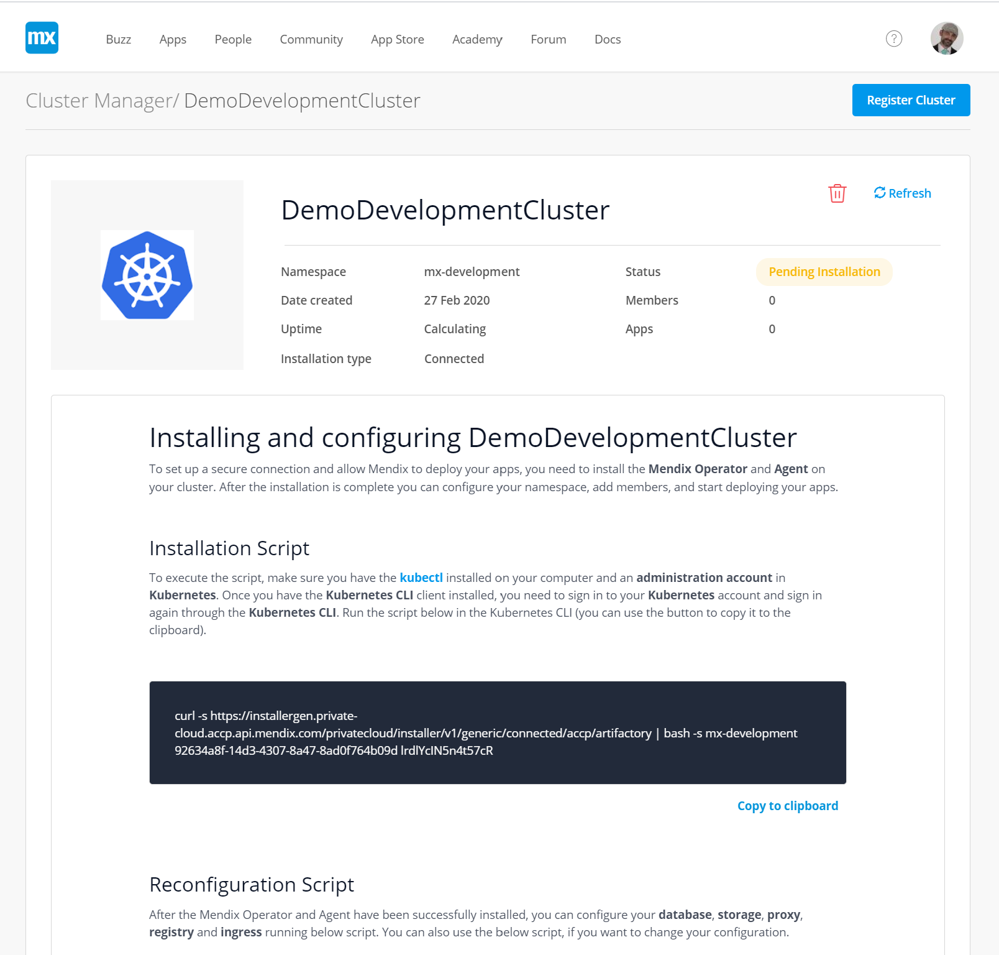
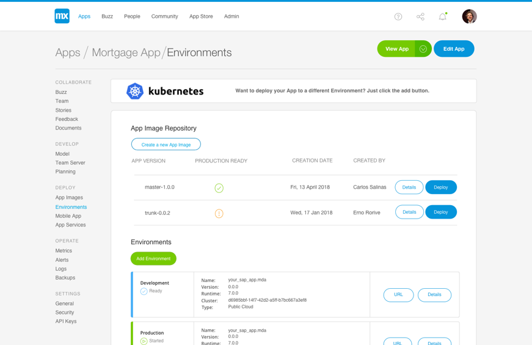
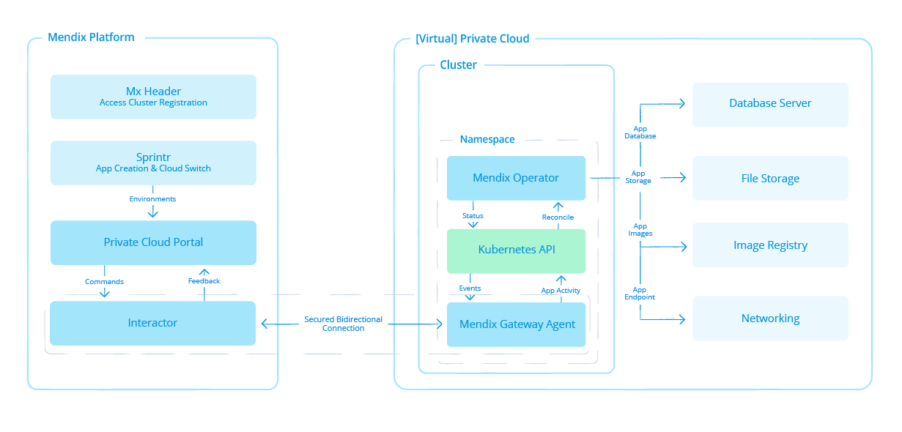
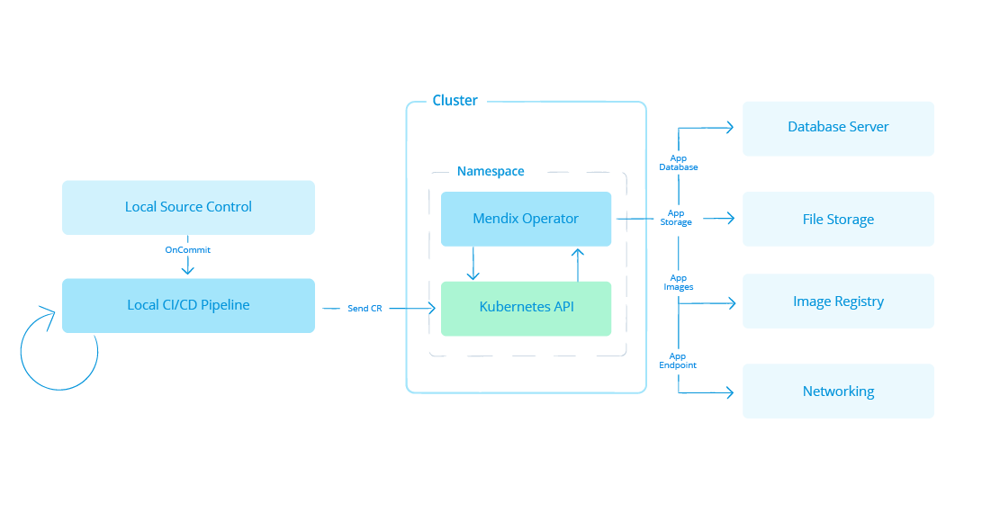
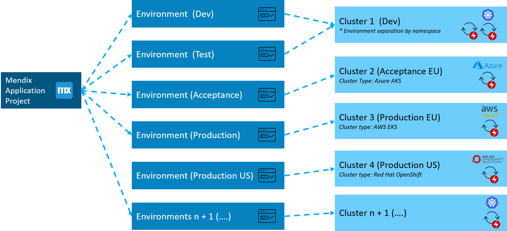
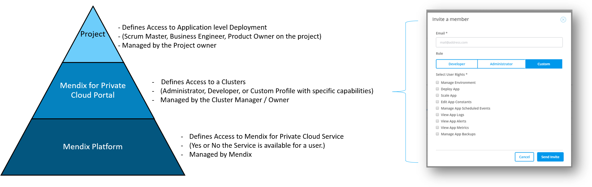

## 1 What Features Are Available in the Mendix for Private Cloud? {#MX4PC}

Mendix For Private Cloud provides the 'LowOps' 1-click deployment experience for which Mendix is known on your own Kubernetes-based (virtual) private cloud solution.

This allows Mendix development teams to manage their application lifecyle (such as Development, Testing, Acceptance, Production), without the need for direct access to their Kubernetes infrastructure or needing to have knowledge of Kubernetes.

The Mendix for Private Cloud experience also includes the ability to access directly the logging and metrics solution connected to the Kubernetes clusters. 

For Kubernetes Administrators, the solution will provide a single initialization script to run on the Kubernetes cluster to install the necessary Mendix for Private Cloud components.

## 2 How Does Application Deployment Management Work?

Mendix for Private Cloud can be used in combination with the Mendix Development Portal experience, giving the Mendix developer full control of their application lifecycle. The portal sends messages to the Kubernetes cluster which trigger the cluster to download the necessary artifacts to build and deploy the application.

For the **Standalone** version of Mendix for Private Cloud, Mendix supplies Kubernetes Custom Resources (CRs) which can be applied to the Kubernetes API. These initiate the provisioning and deployment of an application. This creates an optimal solution in combination with continuous integration and deployment (CI/CD).

For more information on Standalone usage see [How can I use Mendix for Private Cloud Standalone?](#standalone)

## 3 What is the architecture of Mendix for Private Cloud? 

Mendix for Private Cloud is based on the Kubernetes native operator architecture. The Mendix Operator is responsible for deployment, provisioning, backup/recovery, scaling, and building of the Mendix application. By applying a Mendix custom resource to the Kubernetes API, the Operator will perform all necessary task to run the application in a highly available (HA) configuration.
  

To provide the Mendix Deployment experience using the **"Connected"** Mendix Developer Portal, a secure tunnel will be initiated from the private cloud to the Mendix Developer Portal. The Mendix Gateway installed in the Kubernetes cluster is responsible for setting up this tunnel without the need to open ports in the firewall of the private cloud.

The Mendix Operator has only rights to perform actions in its own namespace. Applications deployed by the Operator will be deployed within the same namespace as the Operator. 

## 4 How Can I Use Mendix for Private Cloud Standalone? {#standalone}

If corporate policies won't allow you to have an online connection to the private cloud, it is possible to use Mendix for Private Cloud in **Standalone** mode. In this situation the developer will not be able to use the online portal to manage their applications, but will use a custom CI/CD solution to create the Mendix CR for a new version of the Mendix application.

In these circumstances, a local source code repository is typically used for the models of the Mendix application. By creating a CI/CD pipeline where 'OnCommit' creates the Mendix CR, the integration is established. 

## 5 How can I scale my application within Mendix for Private Cloud? 

An application deployed by Mendix for Private Cloud will, by default, run with two instances. Within the Developer Portal you can change the number of running instances. The memory and CPU allocation can also be changed within the Developer Portal to scale a instance vertically.

For the **Standalone** version, a Mendix CR can be applied to the Kubernetes cluster to scale the application up or down.

## 6 How can I run an application on Multiple Clouds using Mendix for Private Cloud?

With Mendix for Private Cloud, you can create multiple environments for an application within different physical Kubernetes Clusters. For example, an application could have a development environment on Azure AKS and a production environment on RedHat OpenShift.

## 7 How Can I Manage the Authorization of my (Virtual) Private Cloud  

Mendix for Private Cloud defines three standard roles: Cluster Administrator, Cluster Manager, and Developer. 

A Cluster Manager is responsible for the first-time set up of Mendix for Private Cloud on a Kubernetes cluster. The Cluster Manager assigns a Cluster Administrator for the cluster who can delegate access to the cluster to other developers. 

You can set up finely-graded access management for the cluster, such as allowing some developers to only scale the app, or view metrics. 

